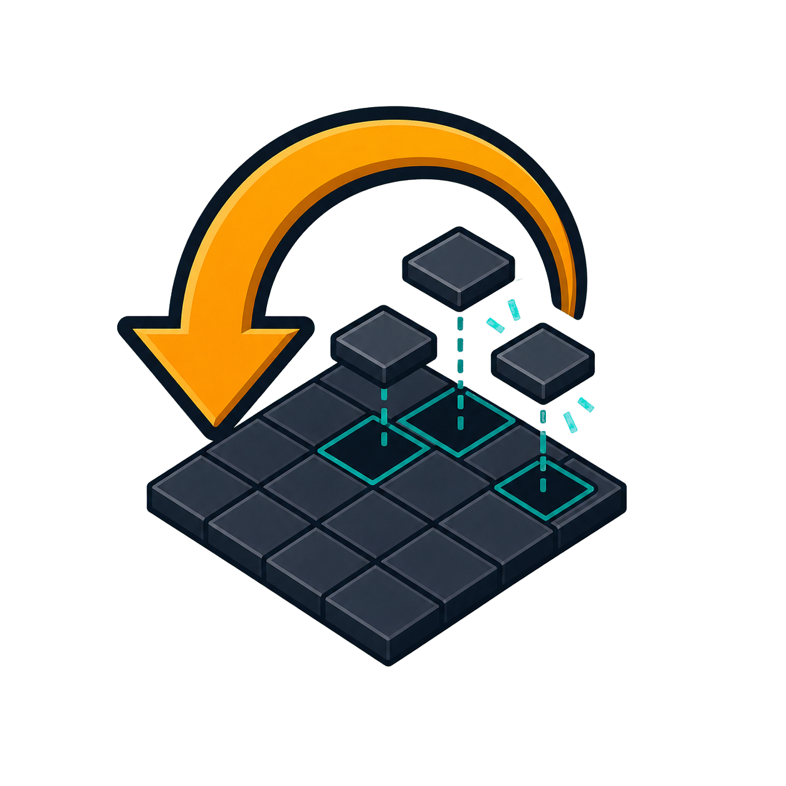

# PZ Reverse Mapper

<p align="center">
  
</p>

PZ Reverse Mapper is a Windows application that rebuilds editable mapping
assets from compiled Project Zomboid map data. It provides a graphical Studio
and a command-line converter based on .NET 8.

The project supports legacy 300 × 300 compiled cells and Build 42 256 × 256
compiled cells. Data is converted through world coordinates before being
written to either classic 300 × 300 WorldEd cells or native 256 × 256 TMX
cells.

> PZ Reverse Mapper is an unofficial community tool. Project Zomboid,
> WorldEd and TileZed are created by The Indie Stone. No game assets are
> included in this repository or in application releases.

## Main features

- Rebuild TMX map cells and a WorldEd PZW project from `.lotheader` and
  `.lotpack` files.
- Convert Build 42 256 × 256 compiled cells to the classic editable
  300 × 300 WorldEd grid.
- Preserve tile layers, rooms, buildings and level information.
- Restore `objects.lua` objects in the generated PZW project.
- Export RoomDef TBX files and supplemental reconstructed building TBX files.
- Generate per-cell and merged map, vegetation, biome and zombie-density
  previews when the corresponding source data exists.
- Extract Project Zomboid texture packs without loading every atlas into RAM
  at once.
- Restore each packed tile to its real canvas using the atlas rectangle,
  offsets, original tile name and stored tile dimensions.
- Rebuild tilesets with the Project Zomboid eight-column layout.
- Run tile extraction by itself without reading map headers or lotpacks.
- Read optional mod assets from a separate read-only folder.

## Tile pack extraction

The extractor separates physical atlas files from logical tileset merging:

```text
TilesRaw/
  Tiles2x.floor.pack/
    Tiles2x0.png
    ...
  Tiles2x.pack/
    Tiles2x0.png
    ...

TilesSingle/
  Tiles2x.pack/
    blends_natural_01/
      blends_natural_01_0.png
      ...

Tiles/
  Tiles2x.pack/
    blends_natural_01.png
    ...
```

`Tiles2x.floor.pack` and `Tiles2x.pack` can contain atlas images with identical
internal names. Their raw atlas directories therefore remain separate. Only
the individual tiles are merged under the matching logical pack after they
have been cut from the correct physical atlas.

Every reconstructed tileset is eight tiles wide. A tileset containing
128-pixel-wide tiles is therefore exactly `8 × 128 = 1024` pixels wide,
regardless of whether the source is 1x, 2x or another scale.

## Requirements

For a packaged release:

- Windows 10 or Windows 11
- .NET 8 Desktop Runtime, unless the release is published as self-contained
- A legally installed copy of Project Zomboid for the game data being read

For building from source:

- .NET 8 SDK
- Visual Studio 2022 is optional

## Using Studio

1. Start `PZReverseMapper.exe`.
2. Select a workflow preset.
3. Select the compiled map folder.
4. Select the Project Zomboid `media` folder for tiles and texture packs.
5. Select a dedicated output folder.
6. Use `Validate` before a map export.
7. Run a small source-cell test before exporting a complete map.

For Build 42 maps intended for WorldEd, use:

```text
B42 source 256 -> TMX 300
```

When `Tile sheets` is the only selected output, Studio automatically enters
tiles-only mode. The compiled map input is not required and no `.lotheader` or
`.lotpack` file is parsed.

The About window explains the project, current version, tile extraction model
and unofficial-project status.

## Command-line examples

Build 42 to classic WorldEd cells:

```powershell
PZReverseMapper.Cli.exe `
  --input "D:\Maps\CompiledMap" `
  --output "D:\Exports\EditableMap" `
  --tiles "C:\Program Files (x86)\Steam\steamapps\common\ProjectZomboid\media" `
  --source-cell-size 256 `
  --target-cell-size 300 `
  --extract-tiles
```

Tiles only:

```powershell
PZReverseMapper.Cli.exe `
  --output "D:\Exports\Tiles" `
  --tiles "C:\Program Files (x86)\Steam\steamapps\common\ProjectZomboid\media" `
  --tiles-only
```

Use `--help` for the complete CLI option list.

## Main outputs

- `tmx/*.tmx` — editable map cells
- `<project>.pzw` — WorldEd project
- `tmx/tbx/<cell>/*.tbx` — RoomDef TBX files
- `tbx_buildings/<source-cell>/*.tbx` — supplemental reconstructed buildings
- `maps_img/*` — per-cell previews
- `Map.png`, `Map_veg.png`, `world.png` — merged map previews
- `Map_ZombieSpawnMap.png` — zombie-density preview when available
- `biomemap.png` — merged Build 42 biomemap when source images exist
- `TilesRaw/<physical-pack>/*` — physical atlas images
- `TilesSingle/<logical-pack>/<tileset>/*.png` — restored individual tiles
- `Tiles/<logical-pack>/*.png` — reconstructed eight-column tilesets

## Repository layout

```text
PZReverseMapper.sln
PZ_Mapper_Studio/       Windows graphical application
PZ_Mapper_Converter/    Command-line application and shared conversion core
assets/                 Repository artwork
```

The historical PZ_Mapper application is intentionally not part of this
standalone repository.

## Build

```powershell
dotnet restore .\PZReverseMapper.sln
dotnet build .\PZReverseMapper.sln -c Release --no-restore
```

Studio output:

```text
PZ_Mapper_Studio/bin/Release/net8.0-windows/PZReverseMapper.exe
```

CLI output:

```text
PZ_Mapper_Converter/bin/Release/net8.0/PZReverseMapper.Cli.exe
```

## Safety and limitations

- Game and mod inputs are read only.
- Existing output is removed only when the guarded clean-output option is
  explicitly enabled and confirmed.
- Reverse-engineered formats can change between Project Zomboid builds.
- Reconstructed building TBX files are supplemental exports, not original
  authoring-source files.
- Always validate a small area before processing a complete map.

## License and credits

PZ Reverse Mapper is source-available software, not open-source software.
Official releases may be used for personal, non-commercial purposes. The
source may be viewed, studied and modified privately, and proposed changes may
be submitted to the official project.

Redistribution, rehosting, resale, public modified versions, forks,
repackaging, commercial exploitation and integration into another product are
not permitted without prior written authorization.

See [LICENSE](LICENSE) for the complete terms and [CREDITS.md](CREDITS.md) for
project credits.
